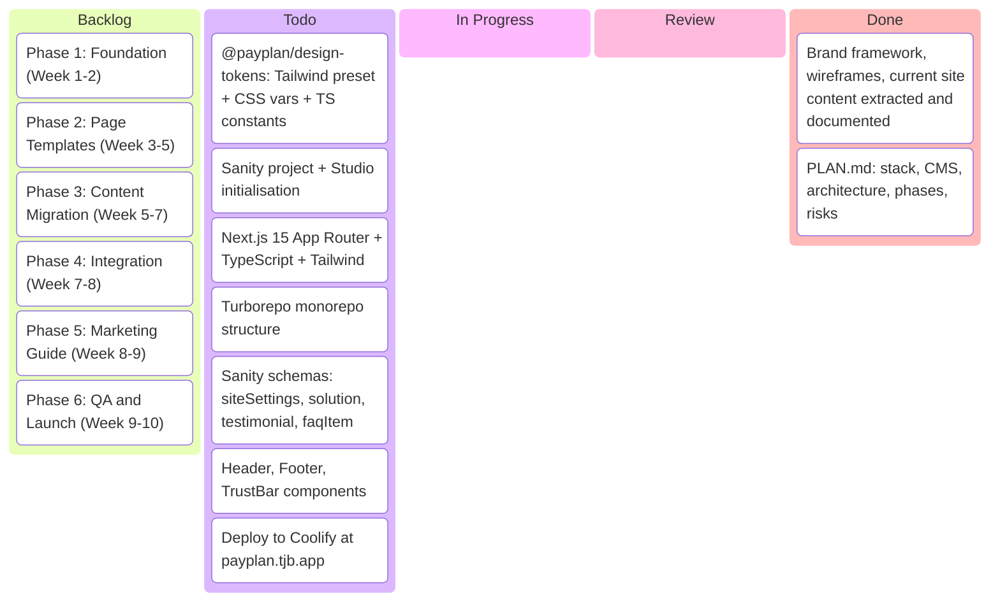

# PayPlan Website Rebuild — Kanban

## Task Details

### Phase 1: Foundation

| Task | Description | Status |
|---|---|---|
| Next.js scaffold | Next.js 15 with App Router, TypeScript strict, Tailwind v4 | Todo |
| Monorepo setup | Turborepo with apps/web, apps/studio, packages/design-tokens | Todo |
| Design tokens package | All brand framework tokens as Tailwind preset + CSS custom properties | Todo |
| Sanity project setup | Create Sanity project, configure Studio, connect to Next.js | Todo |
| Core schemas | siteSettings, solution, testimonial, faqItem content types | Todo |
| Layout components | Header, Footer, TrustBar matching wireframe specs | Todo |
| Coolify deploy | Initial deployment to payplan.tjb.app via Coolify | Todo |
| CI pipeline | Build on push, deploy main to Coolify | Todo |

### Phase 2: Page Templates

| Task | Description | Status |
|---|---|---|
| Homepage | Hero + segmentation grid + three-step + solutions grid + testimonials | Todo |
| Solution page | Breadcrumb + at-a-glance + eligibility + comparison + FAQ accordion | Todo |
| Where Do I Start | Permission-led hero + reassurance + tools + solutions grid | Todo |
| About page | Trust badges + "how can it be free" + Debt Diaries video | Todo |
| Partner landing | Co-branded header + form + partner FAQs (no main nav) | Todo |
| Paid-media landing | No nav + form + trust badges (noindex) | Todo |
| Self-serve assessment | Multi-step form + results + recommendations | Todo |
| Life After Debt | Wellbeing tools + newsletter signup | Todo |

### Phase 3: Content Migration

| Task | Description | Status |
|---|---|---|
| SEO audit | Export rankings, Core Web Vitals baseline | Todo |
| URL redirect map | 330 current URLs → new URLs mapping | Todo |
| Solution content | Migrate all solution pages to Sanity | Todo |
| Debt info articles | Migrate information articles to Sanity | Todo |
| About/contact | Migrate company pages | Todo |
| Blog posts | Migrate news articles | Todo |
| Structured data | JSON-LD on all pages | Todo |
| Sitemap + robots | Auto-generated XML sitemap, robots.txt | Todo |

### Phase 4: Integration

| Task | Description | Status |
|---|---|---|
| Intercom | Load, referral ID handoff, Live Chat trigger | Todo |
| GTM/GA | dataLayer, event tracking continuity | Todo |
| Trustpilot | Widget integration | Todo |
| Module Federation | Setup for squad micro-frontends | Todo |
| Referral ID system | Middleware, cookies, dataLayer push | Todo |

### Phase 5: Marketing Guide

| Task | Description | Status |
|---|---|---|
| VitePress setup | docs/ site with brand framework nav | Todo |
| Content update guide | Creating pages, editing, publishing workflows | Todo |
| Template documentation | What each template does, when to use it | Todo |
| Sanity Studio guide | UI walkthrough for marketing team | Todo |

### Phase 6: QA and Launch

| Task | Description | Status |
|---|---|---|
| Cross-browser testing | Chrome, Safari, Firefox, Edge | Todo |
| Mobile responsive | All breakpoints verified | Todo |
| Accessibility audit | WCAG AA compliance | Todo |
| Performance audit | Core Web Vitals targets met | Todo |
| Redirect verification | All 330 URLs tested | Todo |
| Staging review | Marketing team sign-off | Todo |
| DNS cutover | Plan and execute domain switch | Todo |
