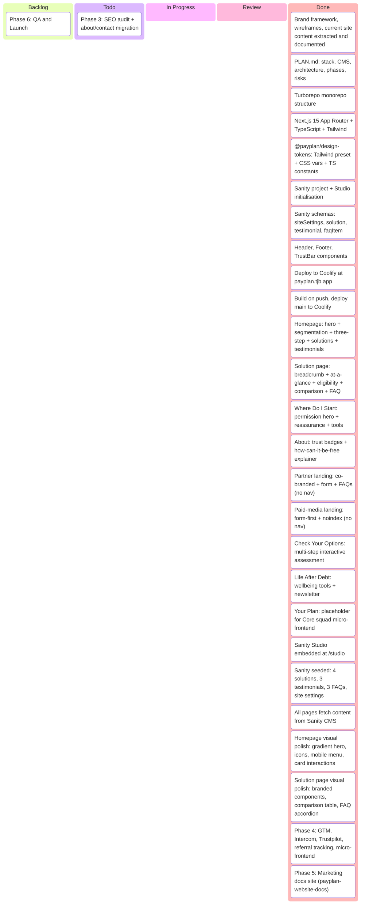

# PayPlan Website Rebuild — Kanban

## Task Details

### Phase 1: Foundation — COMPLETE

| Task | Status |
|---|---|
| Monorepo setup (Turborepo, apps/web, apps/studio, packages/design-tokens) | Done |
| Next.js 15 scaffold (App Router, TypeScript strict, Tailwind v4) | Done |
| Design tokens package (Tailwind preset + CSS vars + TS constants) | Done |
| Sanity project setup (project 0w7asqgt, Studio config) | Done |
| Core schemas (siteSettings, solution, testimonial, faqItem) | Done |
| Layout components (Header, Footer, TrustBar) | Done |
| Coolify deploy (payplan.tjb.app, Dockerfile, standalone output) | Done |
| CI pipeline (auto-deploy on push to main) | Done |

### Phase 2: Page Templates — COMPLETE

| Task | Status |
|---|---|
| Homepage (HeroHome, TrustBar, SegmentationGrid, ThreeStepProcess, TestimonialBlock, SolutionGrid) | Done |
| Solution page (HeroSolution, AtAGlance, EligibilityCheck, ComparisonTable, FaqAccordion) | Done |
| Where Do I Start (HeroPermission, reassurance scenarios, tools) | Done |
| About page (trust badges, "how can it be free", protections) | Done |
| Partner landing page (co-branded header, form, partner FAQs, no nav) | Done |
| Paid-media landing page (form-first, noindex, no nav) | Done |
| Self-serve assessment (Check Your Options, 4-step interactive) | Done |
| Life After Debt (wellbeing tools, confidence areas, newsletter) | Done |
| Your Plan placeholder (for Core squad micro-frontend) | Done |
| Sanity Studio embedded at /studio | Done |
| Sanity content seeded (4 solutions, 3 testimonials, 3 FAQs, site settings) | Done |
| All pages wired to Sanity CMS (GROQ queries, Portable Text rendering) | Done |

### Phase 2.5: Visual Polish — COMPLETE

| Task | Status |
|---|---|
| Homepage to production quality (typography, spacing, imagery, brand feel) | Done |
| DMP solution page to production quality | Done |
| All shared components polished (Header, Footer, TrustBar, cards, tables, accordion) | Done |

### Phase 3: Content Migration — IN PROGRESS

| Task | Status |
|---|---|
| URL redirect map (130+ rules, DMP/IVA/Bankruptcy/DRO sub-pages consolidated) | Done |
| Redirect middleware (next.config.ts redirects) | Done |
| Article schema + routes (/debt-info, /debt-info/[slug]) | Done |
| Blog post schema + routes (/news, /news/[slug]) | Done |
| GROQ queries (articles, blog posts, slugs) | Done |
| Structured data — Organization JSON-LD on all pages | Done |
| Structured data — BreadcrumbSchema + FaqSchema components | Done |
| Sitemap (auto-generated from Sanity content) | Done |
| robots.txt (blocks /studio, /your-plan, /api/) | Done |
| WordPress migration script (HTML → Portable Text, batched upsert) | Done |
| Debt info articles migrated (131 articles from WordPress) | Done |
| Solution pages migrated (10 additional solutions from WordPress) | Done |
| Blog posts migrated (717 posts from WordPress) | Done |
| SEO audit (export rankings, Core Web Vitals baseline) | Todo |
| About/contact pages (migrate company content) | Todo |

### Phase 4: Integration — COMPLETE

| Task | Status |
|---|---|
| GTM/GA (GoogleTagManager component, dataLayer events, virtual page views) | Done |
| Intercom (widget load, LiveChatButton, referral handoff to chat) | Done |
| Trustpilot widget (TrustpilotWidget component on homepage) | Done |
| Module Federation (MicroFrontend component, Your Plan page wired) | Done |
| Referral ID system (middleware captures ref/utm_source, 30-day cookie, dataLayer push) | Done |
| .env.example (all integration env vars documented) | Done |

### Phase 5: Marketing Guide — COMPLETE

| Task | Status |
|---|---|
| VitePress setup (standalone repo, GitHub Actions, PayPlan brand theme) | Done |
| Content update guide (Sanity Studio, block editor, articles, blog posts, solutions) | Done |
| Template documentation (all page templates with section breakdowns) | Done |
| Brand reference (colours, typography, voice, components) | Done |
| Git workflow guide (setup, making changes, environments) | Done |
| SEO strategy reference (redirects, sitemap, structured data, analytics) | Done |
| Integrations reference (GTM, Intercom, Trustpilot, referral tracking) | Done |

### Phase 6: QA and Launch

| Task | Status |
|---|---|
| Cross-browser testing | Todo |
| Mobile responsive (all breakpoints) | Todo |
| Accessibility audit (WCAG AA) | Todo |
| Performance audit (Core Web Vitals targets) | Todo |
| Redirect verification (all 330 URLs) | Todo |
| Staging review (marketing team sign-off) | Todo |
| DNS cutover | Todo |
