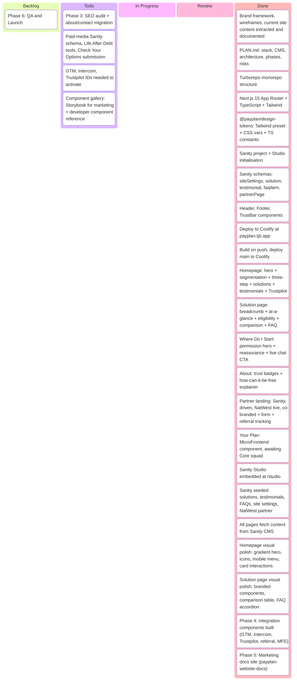

# PayPlan Website Rebuild — Kanban

## Task Details

### Phase 1: Foundation — COMPLETE

| Task | Status |
|---|---|
| Monorepo setup (Turborepo, apps/web, apps/studio, packages/design-tokens) | Done |
| Next.js 15 scaffold (App Router, TypeScript strict, Tailwind v4) | Done |
| Design tokens package (Tailwind preset + CSS vars + TS constants) | Done |
| Sanity project setup (project 0w7asqgt, Studio config) | Done |
| Core schemas (siteSettings, solution, testimonial, faqItem) | Done |
| Layout components (Header, Footer, TrustBar) | Done |
| Coolify deploy (payplan.tjb.app, Dockerfile, standalone output) | Done |
| CI pipeline (auto-deploy on push to main) | Done |

### Phase 2: Page Templates

| Task | Status |
|---|---|
| Homepage (HeroHome, TrustBar, SegmentationGrid, ThreeStepProcess, TestimonialBlock, SolutionGrid) | Done |
| Solution page (HeroSolution, AtAGlance, EligibilityCheck, ComparisonTable, FaqAccordion) | Done |
| Where Do I Start (HeroPermission, reassurance scenarios, live chat CTA) | Done |
| About page (trust badges, "how can it be free", protections) | Done |
| Partner landing page (Sanity schema, NatWest live, co-branded header, form, referral tracking) | Done |
| Paid-media landing page (hardcoded DRO example only — no Sanity schema, can't create new pages without code) | Incomplete |
| Self-serve assessment (Check Your Options — UI works, form submission goes nowhere) | Incomplete |
| Life After Debt (template exists, tool links are `#` placeholders, newsletter form is dummy) | Incomplete |
| Your Plan placeholder (MicroFrontend component wired, awaiting Core squad) | Done (blocked) |
| Sanity Studio embedded at /studio | Done |
| Sanity content seeded (4 solutions, 3 testimonials, 3 FAQs, site settings, NatWest partner) | Done |
| All pages wired to Sanity CMS (GROQ queries, Portable Text rendering) | Done |

### Phase 2.5: Visual Polish — COMPLETE

| Task | Status |
|---|---|
| Homepage to production quality (typography, spacing, imagery, brand feel) | Done |
| DMP solution page to production quality | Done |
| All shared components polished (Header, Footer, TrustBar, cards, tables, accordion) | Done |

### Phase 3: Content Migration — IN PROGRESS

| Task | Status |
|---|---|
| URL redirect map (130+ rules, DMP/IVA/Bankruptcy/DRO sub-pages consolidated) | Done |
| Redirect middleware (next.config.ts redirects) | Done |
| Article schema + routes (/debt-info, /debt-info/[slug]) | Done |
| Blog post schema + routes (/news, /news/[slug]) | Done |
| GROQ queries (articles, blog posts, slugs) | Done |
| Structured data — Organization JSON-LD on all pages | Done |
| Structured data — BreadcrumbSchema + FaqSchema components | Done |
| Sitemap (auto-generated from Sanity content) | Done |
| robots.txt (blocks /studio, /your-plan, /api/) | Done |
| WordPress migration script (HTML → Portable Text, batched upsert) | Done |
| Debt info articles migrated (131 articles from WordPress) | Done |
| Solution pages migrated (10 additional solutions from WordPress) | Done |
| Blog posts migrated (717 posts from WordPress) | Done |
| SEO audit (export rankings, Core Web Vitals baseline) | Todo |
| About/contact pages (migrate company content) | Todo |

### Phase 4: Integration

| Task | Status | Notes |
|---|---|---|
| GTM/GA (GoogleTagManager component, dataLayer events, virtual page views) | Built — needs ID | Set `NEXT_PUBLIC_GTM_ID` to activate |
| Intercom (widget load, LiveChatButton, referral handoff to chat) | Built — needs config | App ID set, EU endpoint configured. Domain `payplan.tjb.app` must be added to trusted domains in Intercom Settings → Installation → Web |
| Trustpilot widget (TrustpilotWidget component on homepage) | Built — needs ID | Set `NEXT_PUBLIC_TRUSTPILOT_BUSINESS_UNIT_ID` to activate |
| Module Federation (MicroFrontend component, Your Plan page wired) | Built — awaiting Core | Set `NEXT_PUBLIC_CORE_MFE_URL` when available |
| Referral ID system (middleware captures ref/utm_source, 30-day cookie, dataLayer push) | Done | Active now, no credentials needed |
| Partner page referral + Intercom handoff | Done | Works end-to-end when Intercom ID is set |
| .env.example (all integration env vars documented) | Done | |

### Phase 5: Marketing Guide — COMPLETE

| Task | Status |
|---|---|
| VitePress setup (standalone repo, GitHub Actions, PayPlan brand theme) | Done |
| Content update guide (Sanity Studio, block editor, articles, blog posts, solutions) | Done |
| Template documentation (all page templates with section breakdowns) | Done |
| Brand reference (colours, typography, voice, components) | Done |
| Git workflow guide (setup, making changes, environments) | Done |
| SEO strategy reference (redirects, sitemap, structured data, analytics) | Done |
| Integrations reference (GTM, Intercom, Trustpilot, referral tracking) | Done |

### Incomplete Pages — needs attention

| Page | What works | What doesn't |
|---|---|---|
| Paid-media landing (`/lp/[slug]`) | Single hardcoded DRO example renders | No Sanity schema — can't create new campaigns without code changes |
| Check Your Options (`/check-your-options`) | 4-step assessment UI, solution recommendations | Form submission does nothing — no backend, no Intercom trigger, no dataLayer event |
| Life After Debt (`/life-after-debt`) | Page template, confidence areas | Tool links go to `#`, newsletter signup is a non-functional form |

### Storybook — Component Gallery

**Purpose:** Give the marketing team a visual catalogue of reusable page sections (like WordPress blocks) and give future developers a living component reference. The marketing team is coming from PHP/WordPress where they could browse and compose blocks — this provides parity without requiring them to edit React code.

**Setup:**

| Task | Status | Notes |
|---|---|---|
| Scaffold `apps/storybook` in monorepo | Todo | Storybook 8, React + Vite, `@storybook/nextjs` framework |
| Configure Tailwind v4 + design tokens | Todo | Import `@payplan/design-tokens` preset so stories render with real brand styling |
| Deploy to GitHub Pages or Coolify | Todo | Separate from main site — e.g. `storybook.tjb.app` or GH Pages |
| Add link from docs site | Todo | Card on docs landing page + sidebar entry |

**Stories to write — page sections (priority):**

These are the "blocks" the marketing team should see. Each story should show the component with realistic PayPlan content, not lorem ipsum.

| Component | File | What it shows |
|---|---|---|
| HeroHome | `components/hero/HeroHome.tsx` | Homepage hero with gradient, headline, CTAs |
| HeroSolution | `components/hero/HeroSolution.tsx` | Solution page hero with breadcrumb |
| HeroPermission | `components/hero/HeroPermission.tsx` | "Where Do I Start" permission-based hero |
| TrustBar | `components/layout/TrustBar.tsx` | FCA regulated, Trustpilot, people helped badges |
| SegmentationGrid | `components/content/SegmentationGrid.tsx` | "What kind of debt?" audience cards |
| ThreeStepProcess | `components/content/ThreeStepProcess.tsx` | Three-step "how it works" |
| SolutionGrid | `components/content/SolutionGrid.tsx` | Grid of solution cards |
| TestimonialBlock | `components/content/TestimonialBlock.tsx` | Customer testimonials carousel/grid |
| FaqAccordion | `components/content/FaqAccordion.tsx` | Expandable FAQ section |
| AtAGlance | `components/content/AtAGlance.tsx` | Solution "at a glance" key facts |
| EligibilityCheck | `components/content/EligibilityCheck.tsx` | "May suit you if" / "Things worth knowing" |
| ComparisonTable | `components/content/ComparisonTable.tsx` | Solution comparison table |
| LiveChatButton | `components/integrations/LiveChatButton.tsx` | Intercom chat CTA button |
| TrustpilotWidget | `components/integrations/Trustpilot.tsx` | Trustpilot review widget |

**Stories to write — layout:**

| Component | File | What it shows |
|---|---|---|
| Header | `components/layout/Header.tsx` | Main site header with nav, mobile menu |
| Footer | `components/layout/Footer.tsx` | Footer with FCA text, links |

**Implementation notes:**

- Use `@storybook/nextjs` framework to handle Next.js `Image`, `Link`, `useRouter` automatically
- Stories need mock data — create a `stories/fixtures/` directory with realistic Sanity-shaped objects (solutions, testimonials, FAQs) so stories don't depend on a live CMS connection
- Group stories by category in sidebar: "Heroes", "Content Sections", "Layout", "Integrations"
- Add a welcome/intro page explaining what the gallery is for (aimed at marketing team, not developers)
- Components that call Sanity (like pages) are NOT in scope — only presentational components that accept props

### Phase 6: QA and Launch

| Task | Status |
|---|---|
| Cross-browser testing | Todo |
| Mobile responsive (all breakpoints) | Todo |
| Accessibility audit (WCAG AA) | Todo |
| Performance audit (Core Web Vitals targets) | Todo |
| Redirect verification (all 330 URLs) | Todo |
| Staging review (marketing team sign-off) | Todo |
| DNS cutover | Todo |
